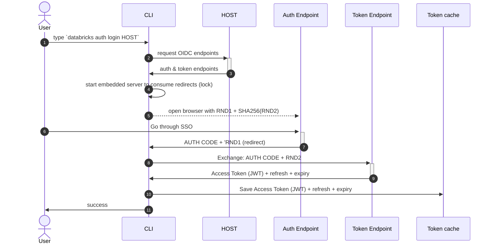
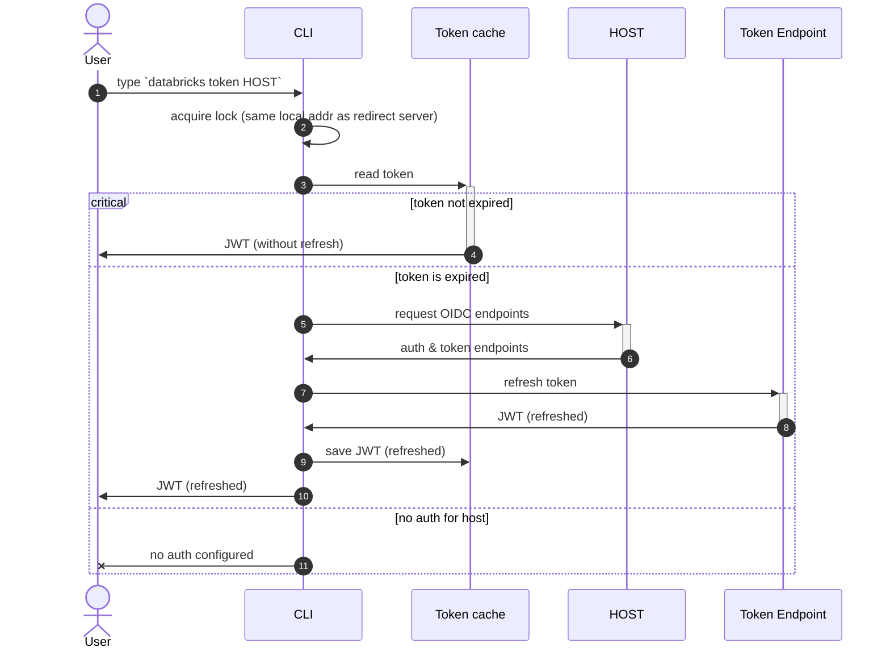

# Auth challenge (happy path)

Simplified description of [PKCE](https://oauth.net/2/pkce/) implementation:

```mermaid
sequenceDiagram
    autonumber
    actor User

    User ->> CLI: type `databricks auth login HOST`
    CLI ->>+ HOST: request OIDC endpoints
    HOST ->>- CLI: auth & token endpoints
    CLI ->> CLI: start embedded server to consume redirects (lock)
    CLI -->>+ Auth Endpoint: open browser with RND1 + SHA256(RND2)

    User ->>+ Auth Endpoint: Go through SSO
    Auth Endpoint ->>- CLI: AUTH CODE + 'RND1 (redirect)

    CLI ->>+ Token Endpoint: Exchange: AUTH CODE + RND2
    Token Endpoint ->>- CLI: Access Token (JWT) + refresh + expiry
    CLI ->> Token cache: Save Access Token (JWT) + refresh + expiry
    CLI ->> User: success
```

# Token refresh (happy path)

```mermaid
sequenceDiagram
    autonumber
    actor User

    User ->> CLI: type `databricks token HOST`

    CLI ->> CLI: acquire lock (same local addr as redirect server)
    CLI ->>+ Token cache: read token

    critical token not expired
    Token cache ->>- User: JWT (without refresh)

    option token is expired
    CLI ->>+ HOST: request OIDC endpoints
    HOST ->>- CLI: auth & token endpoints
    CLI ->>+ Token Endpoint: refresh token
    Token Endpoint ->>- CLI: JWT (refreshed)
    CLI ->> Token cache: save JWT (refreshed)
    CLI ->> User: JWT (refreshed)

    option no auth for host
    CLI -X User: no auth configured
    end
```
