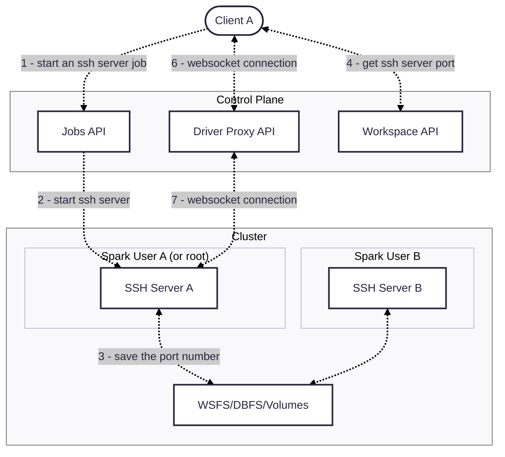
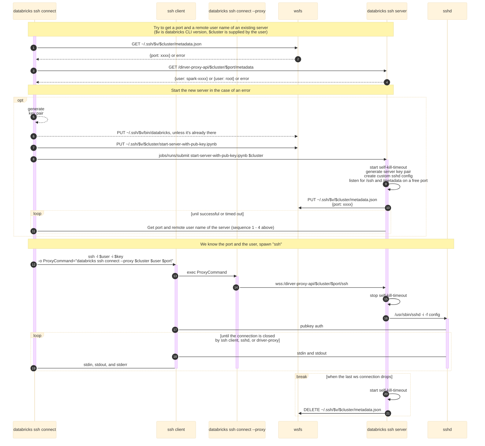

## SSH Tunnel for Databricks
SSH tunnel lets customers connect any IDE to Databricks clusters to run and debug all code - including non-Spark/ML- with environment parity, and simple setup.

## Cluster Requirements
- Dedicated (single user) access mode if you want to use Remote Development tools in IDEs
- Dedicated or Standard access mode for terminal ssh connections

## Usage
A. With local ssh config setup:
```shell
databricks ssh setup --name=hello --cluster=id # one time only
ssh hello # use system SSH client to create a session
```
B. Spawn an ssh session directly:
```shell
databricks ssh connect --cluster=id
```

## Development
```shell
make build snapshot-release
./cli ssh connect --cluster=<id> --releases-dir=./dist --debug # or modify ssh config accordingly
```

## Design

High level:


Connection flow:

