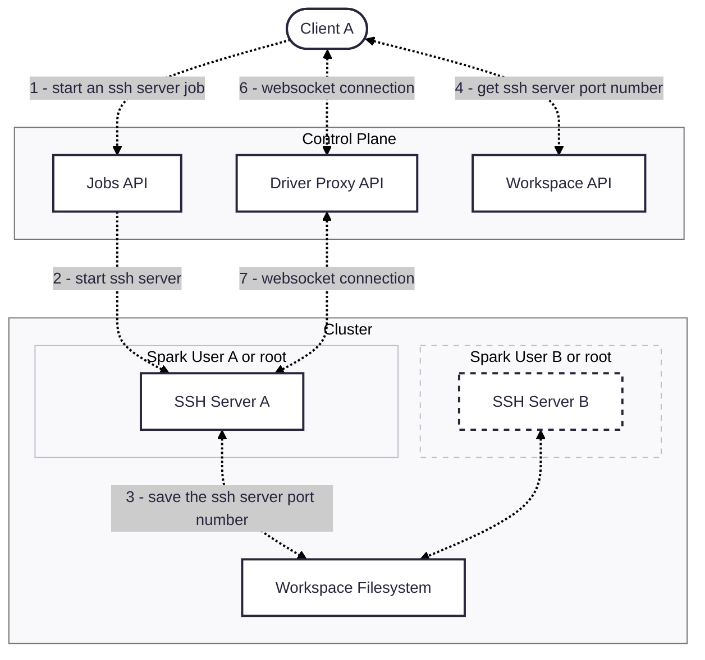
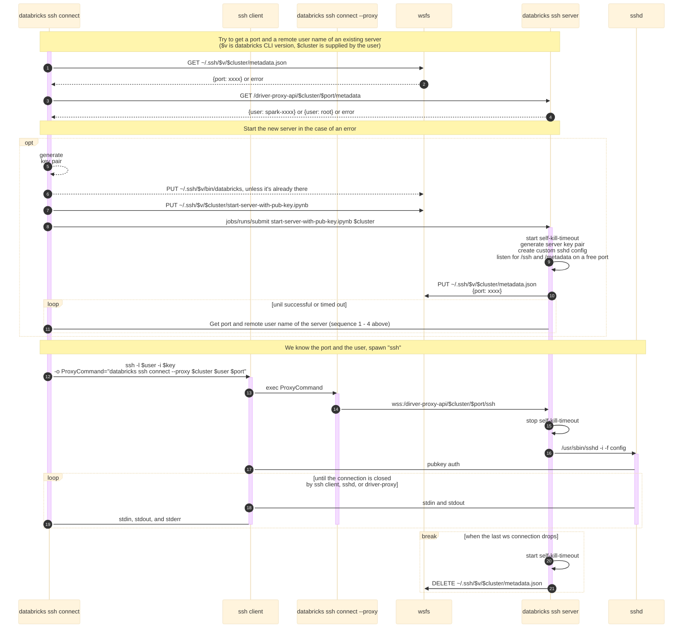

## SSH Tunnel for Databricks

The SSH tunnel lets customers connect any IDE to Databricks compute to run and debug all code - including non-Spark/ML - with environment parity, and simple setup.

## Compute Requirements
- Dedicated (single user) access mode if you want to use Remote Development tools in IDEs
- Dedicated or standard access mode for terminal SSH connections

## Usage
A. With local ssh config setup:
```shell
databricks ssh setup --name=hello --cluster=id # one time only
ssh hello # use system SSH client to create a session
```
B. Spawn an ssh session directly:
```shell
databricks ssh connect --cluster=id
```

## Development
```shell
./task build snapshot-release
./cli ssh connect --cluster=<id> --releases-dir=./dist --debug # or modify ssh config accordingly
```

To reproduce and test the known `ssh connect` failure modes (container missing `sshd`, or a
container that can't run the Python bootstrap), see [FAILURE_MODES.md](./FAILURE_MODES.md).

## Keeping detached processes alive

By default nothing outlives the session: when the last client disconnects, the server shuts
down after `--shutdown-delay` and the bootstrap notebook sweeps every process it parents,
including work that was deliberately detached with `tmux`, `setsid` or `nohup`.

`databricks ssh connect --cluster=<id> --keep-detached-for=<duration>` changes that. On
teardown the tunnel terminates only its own process group - the server and its `sshd`
children - and then holds the job run open for up to `<duration>` while any detached process
is still running. Two things to know before using it:

- **It holds the cluster up.** A `RUNNING` job run suppresses autotermination, so the
  cluster keeps accruing DBUs until the work finishes or the duration runs out. That is why
  the flag takes a duration rather than a boolean, and why it is off by default: the unit of
  the knob is the thing being spent. `--keep-detached-for` cannot exceed the job's own 24h
  timeout, and multi-day work still belongs in Jobs/DABs. Note also that reconnecting starts
  a new run rather than rejoining the lingering one, so each session with live detached work
  leaves its own run behind.
- **The notebook has to stay alive, not just the process.** Workspace filesystem access is
  authorized by walking the live process tree for a registered ancestor, and the bootstrap
  notebook is that ancestor. A detached process that outlives it keeps `/dbfs` and REST API
  access but loses `/Workspace` and `/Volumes` with `EPERM` - which is why the group-scoped
  teardown is tied to the linger and not enabled on its own.

Dedicated clusters only. On serverless the container is torn down with the run, so survivors
die regardless and the flag is rejected.

When the flag is *not* set and the server does find detached processes at teardown, it logs a
warning naming them, so work that is about to be swept is no longer lost silently.

## Design

High level:


Connection flow:

