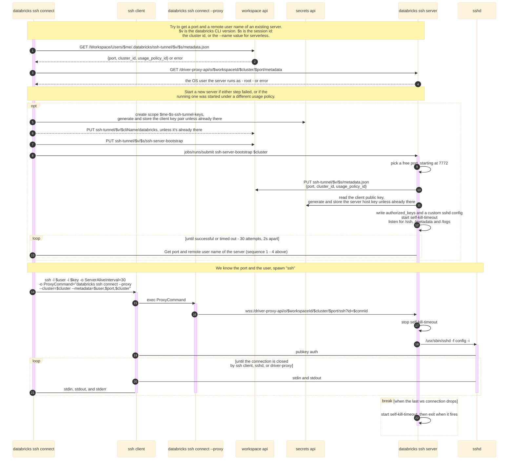

## SSH Tunnel for Databricks

The SSH tunnel lets customers connect any IDE to Databricks compute to run and debug all code - including non-Spark/ML - with environment parity, and simple setup.

## Compute Requirements
- Serverless compute, which is the default when `--cluster` is omitted, or
- A cluster in Dedicated access mode assigned to a single user, not to a group.

`ValidateClusterAccess` (`internal/client/client.go`) rejects every other access mode up front,
for terminal SSH sessions as well as for IDE Remote Development: the tunnel runs as a job that
attaches as a single user. Standard access mode (`USER_ISOLATION`), Dedicated-to-a-group, and
no-isolation clusters all fail with `cluster '<id>' must be a dedicated single-user cluster`.

## Usage
A. With local ssh config setup:
```shell
databricks ssh setup --name=hello --cluster=id # one time only
ssh hello # use system SSH client to create a session
```
B. Spawn an ssh session directly:
```shell
databricks ssh connect --cluster=id
```

## Development
```shell
./task build snapshot-release
./cli ssh connect --cluster=<id> --releases-dir=./dist --debug # or modify ssh config accordingly
```

To reproduce and test the known `ssh connect` failure modes (container missing `sshd`, or a
container that can't run the Python bootstrap), see [FAILURE_MODES.md](./FAILURE_MODES.md).

## Design

High level:


The client public key reaches the server through a secret scope rather than through the
bootstrap notebook, and the server host key is persisted in the same scope so its fingerprint
survives a restart - which is what makes `StrictHostKeyChecking accept-new` safe here.

Connection flow:


Note that `metadata.json` is published before the server starts accepting connections, and is
left behind when the server exits. Neither its presence nor its contents prove that a server is
running, which is why the client always re-checks `/metadata` through the driver proxy before
reusing a port.
