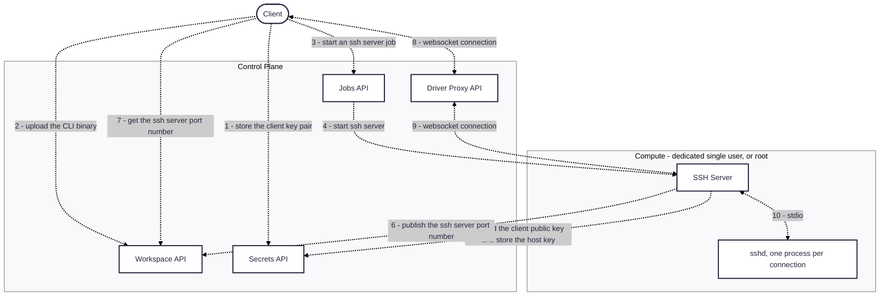
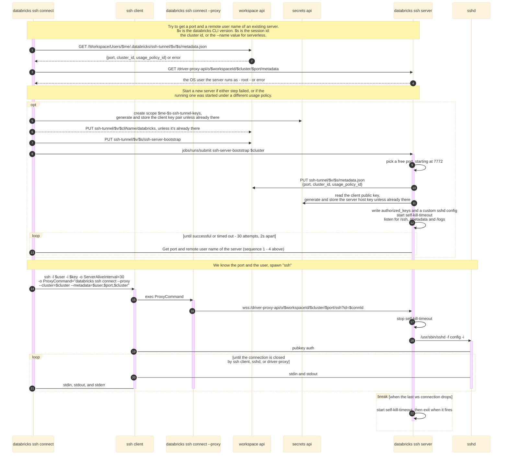
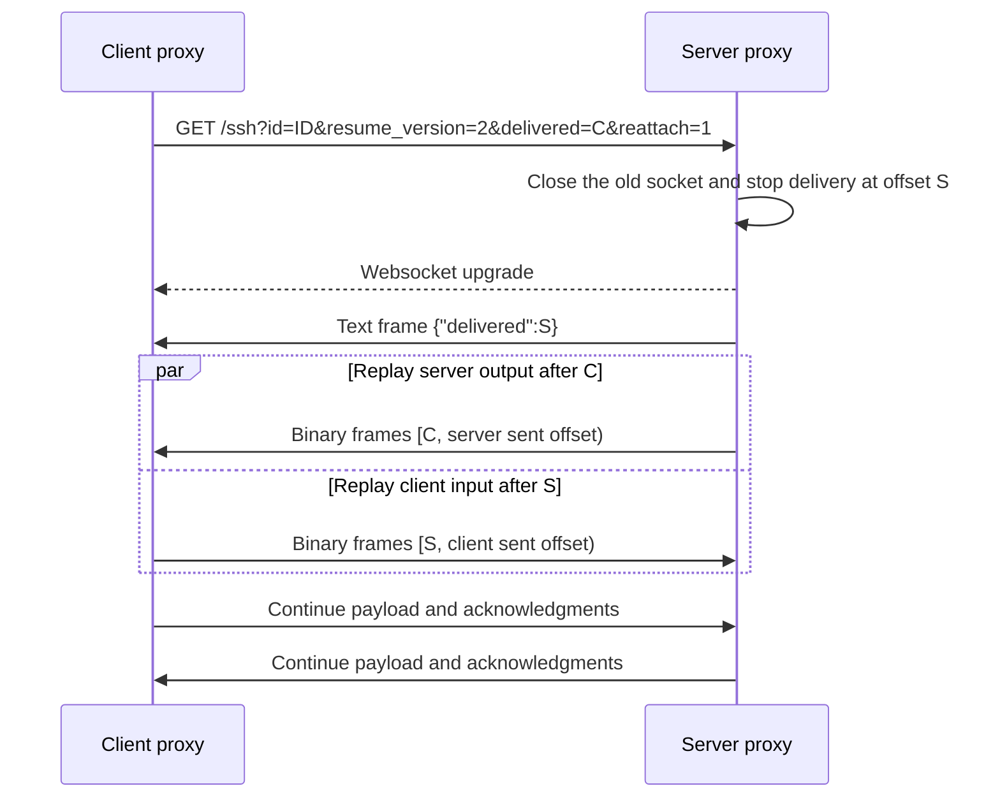

## SSH Tunnel for Databricks

The SSH tunnel lets customers connect any IDE to Databricks compute to run and debug all code - including non-Spark/ML - with environment parity, and simple setup.

## Compute Requirements
- Serverless compute, which is the default when `--cluster` is omitted, or
- A cluster in Dedicated access mode assigned to a single user, not to a group.

`ValidateClusterAccess` (`internal/client/client.go`) rejects every other access mode up front,
for terminal SSH sessions as well as for IDE Remote Development: the tunnel runs as a job that
attaches as a single user. Standard access mode (`USER_ISOLATION`), Dedicated-to-a-group, and
no-isolation clusters all fail with `cluster '<id>' must be a dedicated single-user cluster`.

## Usage
A. With local ssh config setup:
```shell
databricks ssh setup --name=hello --cluster=id # one time only
ssh hello # use system SSH client to create a session
```
B. Spawn an ssh session directly:
```shell
databricks ssh connect --cluster=id
```

### Connection names and host keys

`--name` is a stable handle for serverless compute, not a live session id: connecting with a
name reuses the SSH server still running under it, and starts a new one on the same name once
the previous server has shut down (`--shutdown-delay` after its last client disconnects).

Both cases verify the server's host key. The server generates the key on first use, keeps it in
the connection's secret scope in the workspace and reuses it for every `sshd` it launches, so
the workspace is the authority on the key. The client reads it from there and pins it in
`~/.databricks/ssh-tunnel-known-hosts/<name>` before each connection, and points ssh at that
file with `StrictHostKeyChecking yes`. Tunnel host keys therefore never land in
`~/.ssh/known_hosts`, where a name - unique only within one workspace - would collide with an
entry left by other compute.

## Development
```shell
./task build snapshot-release
./cli ssh connect --cluster=<id> --releases-dir=./dist --debug # or modify ssh config accordingly
```

To reproduce and test the known `ssh connect` failure modes (container missing `sshd`, or a
container that can't run the Python bootstrap), see [FAILURE_MODES.md](./FAILURE_MODES.md).

## Design

High level:


The client public key reaches the server through a secret scope rather than through the
bootstrap notebook, and the server host key is persisted in the same scope so its fingerprint
survives a restart - which is what makes `StrictHostKeyChecking accept-new` safe here.

Connection flow:


Note that `metadata.json` is published before the server starts accepting connections, and is
left behind when the server exits. Neither its presence nor its contents prove that a server is
running, which is why the client always re-checks `/metadata` through the driver proxy before
reusing a port.

### Session resume protocol

Resume protocol v2 lets an SSH session survive a dropped websocket without losing or duplicating
bytes. The protocol is symmetric: the client and server keep separate offsets and replay buffers
for their outgoing streams.

Before opening the websocket, the client requests `/capabilities`. It enables resume only when the
server returns `{"resume_version":2}`. A missing route, another version, an invalid response, or a
probe that takes more than ten seconds leaves resume disabled. The SSH connection still proceeds.
When resume is enabled, the initial websocket URL includes these query parameters:

| Parameter | Initial value | Meaning |
| --- | --- | --- |
| `id` | A new session UUID | Identifies the SSH session across websocket connections. |
| `resume_version` | `2` | Selects this protocol version. |
| `delivered` | `0` | Reports how many peer payload bytes this side has written to its local stream. |

Binary websocket frames carry SSH payload. Text frames contain `{"delivered":N}` and acknowledge
that the receiver wrote the first `N` bytes to sshd's stdin on the server or stdout on the client.
Each side appends outgoing payload to a one MiB replay buffer before writing it to the websocket.
Acknowledgments release buffer space. The receiver sends them after 64 KiB or 100 milliseconds.
When the buffer is full, the sender stops reading its source until an acknowledgment frees space.

After an unexpected disconnect, the client retries for 60 seconds. The server retains the session
for 90 seconds so it remains available throughout that retry period.



The `delivered` value on the reattach URL tells the server where to replay its output. The first
text frame on the new websocket gives the client the corresponding offset for its input. Each side
replays the buffered range from the peer's offset before sending new payload. The server returns
HTTP 409 when the existing session did not negotiate resume and HTTP 410 when the session no longer
exists. Those responses stop retries; other connection failures retry within the 60-second budget.

A normal websocket close with reason `finished` ends the session instead of starting a reattach.
This explicit reason distinguishes a clean EOF from a dropped connection. Scheduled authentication
handovers reuse the same session ID without `reattach=1`; if a handover itself drops, protocol v2
uses the same reattach exchange to recover it.
